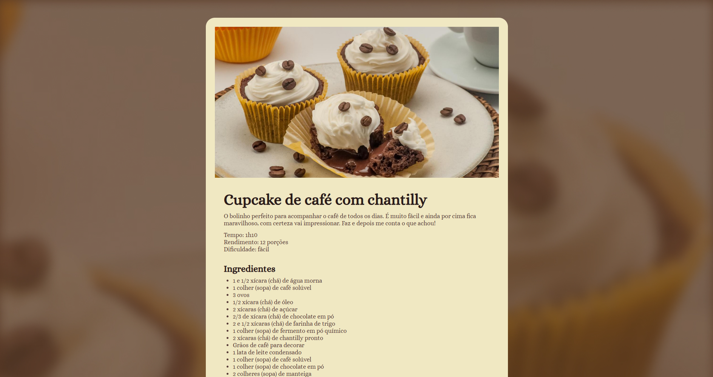

# Página de Receita

Página de receita desenvolvida durante os estudos.



## Sobre

Projeto de uma página web apresentando uma receita de cupcake de café com chantilly.

## Tecnologias

- HTML
- CSS

## Design

- [Figma](https://www.figma.com/design/a6UOUFfA4TA0osOkdrOkrK/P%C3%A1gina-de-receita--Community-?m=auto&t=FOmR5oypt2X7fFHP-6)

## Como executar

```bash
# Clone este repositório
git clone https://github.com/sillasemanoel/study-recipe-page

# Entre na pasta do projeto
cd study-recipe-page

# Abra o arquivo index.html no seu navegador
```

## Autor

Sillas Emanoel
